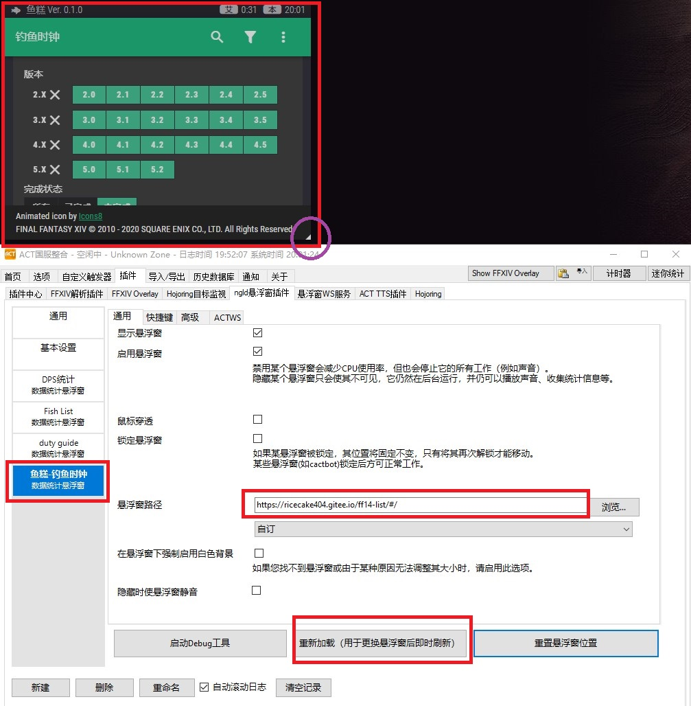

# 帮助

## 浏览器支持
**不支持**IE浏览器

## 在ACT上使用
### 步骤

通过使用ACT的ngld悬浮窗插件可以加载本网站。

1. 确保安装了ACT以及ngld悬浮窗插件
    - Advanced Combat Tracker
    - ngld/OverlayPlugin
    
2. 选择 `插件` - `ngld悬浮窗插件`，点击下方`新建`按钮，在出现的对话框中
    - 名称：输入任意字符串
    
    - 预设：自订
    
    - 种类：数据统计
    
      
    
3. 在左侧栏位中选择上一步新建的悬浮窗，在 `悬浮窗路径处`填入 `https://ricecake404.gitee.io/ff14-list/#/`，点击重新加载。界面默认会显示在屏幕左上角。将鼠标移动至右下角白色三角处可以调整界面大小。

      

### 通过ACT使用时的一些限制

- 由于输入会被游戏捕捉，因此在ACT下无法正常使用输入功能。
- 当网站版本更新时，需要再次使用配置界面中`重新加载`功能刷新页面，（浏览器中直接`F5`或`Ctrl+F5`）。