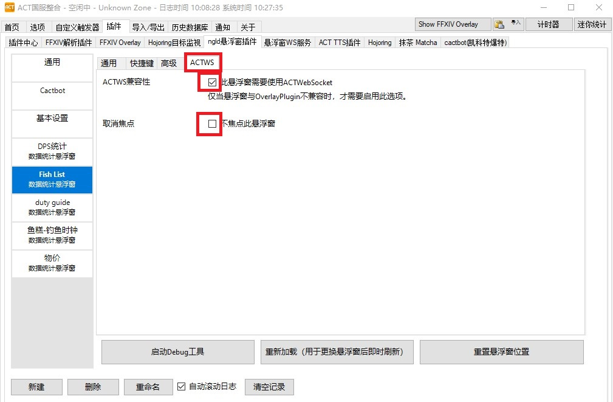
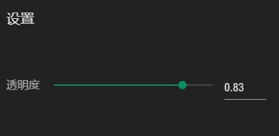
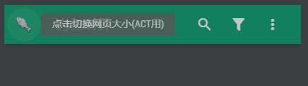

## 浏览器支持
**不支持**IE浏览器

## 在ACT上使用
### 步骤

通过使用ACT的ngld悬浮窗插件可以加载本网站。

1. 确保安装了ACT以及ngld悬浮窗插件
    - Advanced Combat Tracker
    - ngld/OverlayPlugin
    
2. 选择 `插件` - `ngld悬浮窗插件`，点击下方`新建`按钮，在出现的对话框中
    - 名称：输入任意字符串
    
    - 预设：自订
    
    - 种类：数据统计
    
      
    
3. 在左侧栏位中选择上一步新建的悬浮窗，在 `悬浮窗路径`处填入 `https://ricecake404.gitee.io/ff14-list`，点击重新加载。界面默认会显示在屏幕左上角。将鼠标移动至右下角白色三角处可以调整界面大小。(此处勾选`锁定悬浮窗`可以正常使用设置中的拖动条)

      

4. 点击 `ACTWS`，勾选`此悬浮窗需要使用ACTWebDocket`，**不**勾选`不焦点此悬浮窗`。这样在游戏中点击窗口时会将焦点设置为悬浮窗，这样便能够正常输入了。

### ACT可用的一些配置

- 设置中可以调节透明度(ACT悬浮窗设置中勾选锁定悬浮窗可以正常使用拖动条，也可以直接点击绿线或输入值来设置)
  
  

- 点击钓鱼时钟旁的鱼的图标可以缩小界面

  

### 通过ACT使用时的一些限制

- 由于输入会被游戏捕捉，需要设置ACTWS。但是即使设置了，也无法使用输入法，作为后备方案，搜索框同时也支持拼音搜索。
- 当网站版本更新时，需要再次使用配置界面中`重新加载`功能刷新页面，（浏览器中直接`F5`或`Ctrl+F5`）。